# data-platform-on-aws

<p align="center"><b>以下の書籍に関するリポジトリです。データソースを担当します</b></p>

<p align="center">
    <a href="https://www.amazon.co.jp/dp/4297145634/ref=sspa_dk_detail_0?psc=1&pd_rd_i=4297145634&pd_rd_w=BXEhW&content-id=amzn1.sym.f293be60-50b7-49bc-95e8-931faf86ed1e&pf_rd_p=f293be60-50b7-49bc-95e8-931faf86ed1e&pf_rd_r=VZ7P7XN3YX1NAMJAPZEB&pd_rd_wg=CuOVv&pd_rd_r=31953068-34be-40e1-978d-b417f6b20227&s=books&sp_csd=d2lkZ2V0TmFtZT1zcF9kZXRhaWw">
        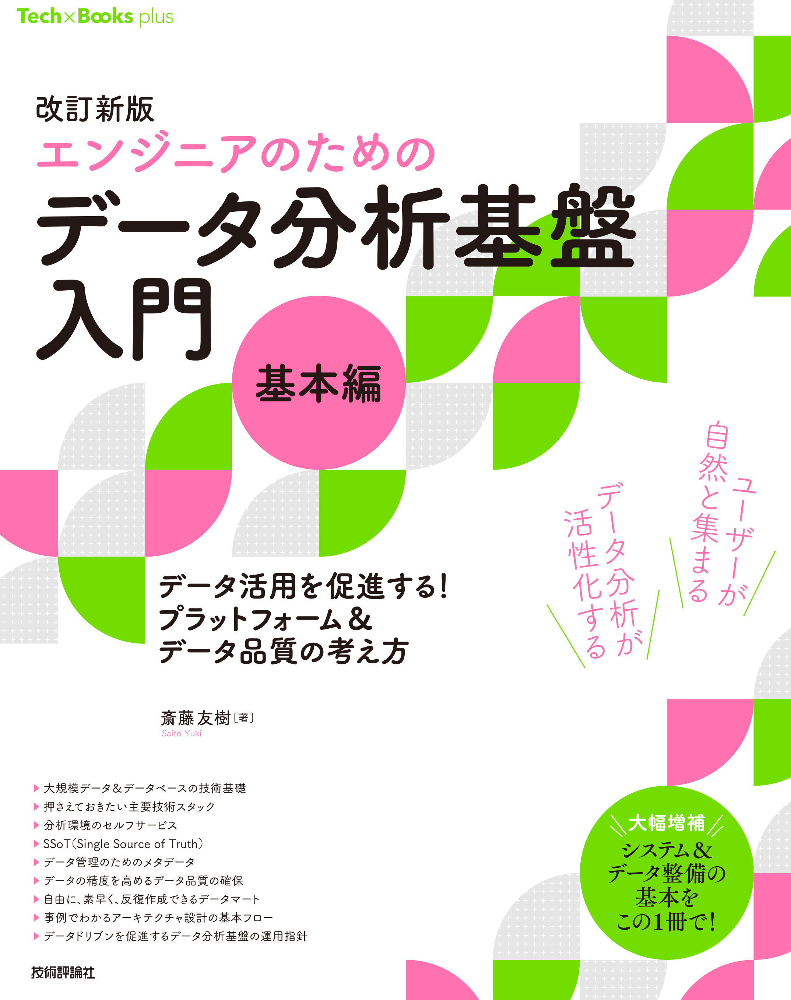
    </a>
    <a href>
        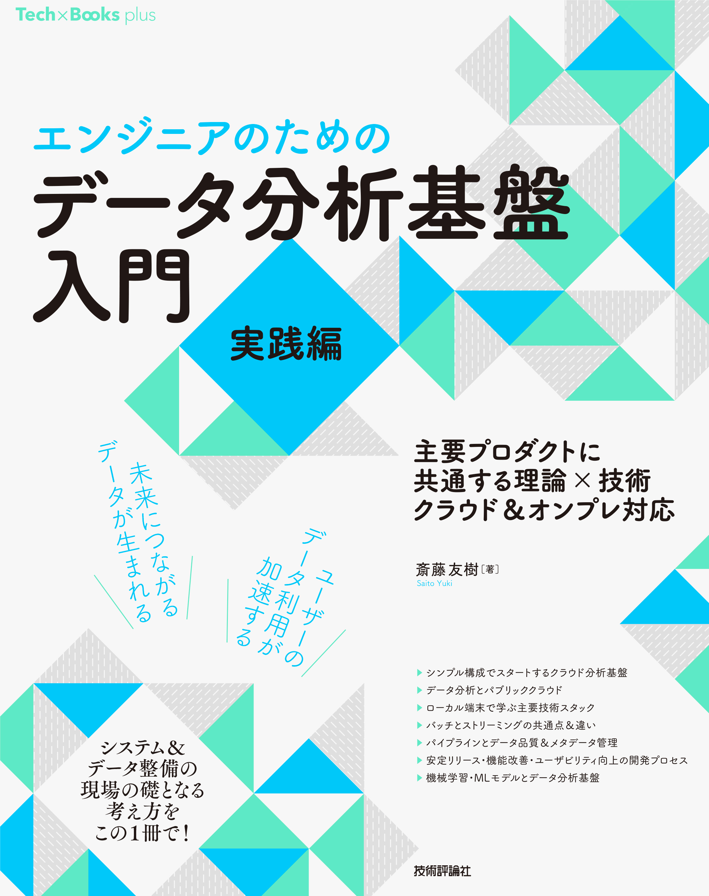
    </a>
</p>

<div align="center">
    


[](https://github.com/yk-st/data-platform-on-aws/releases)


</div>


# このリポジトリについて

本リポジトリは『エンジニアのための データ分析基盤入門（実践編）』の検証用リポジトリです。  
本書の内容を再現できること（再現性）を優先しているため、利用するプロダクトやバージョンは常に最新とは限りません。

筆者の検証環境では動作確認を行っていますが、OS・CPU（Intel/Apple Silicon）・Docker/仮想化設定・リソース制限・ネットワーク設定などの環境差分により、同一結果を再現できない場合があります。  
そのため、各環境固有の差分吸収（設定調整、バージョン更新、リソース確保、起動時期の違いによる影響等）は、各自で適宜対応してください。

筆者は、利用プロダクトのバージョンアップ等による変更やメンテナンス状況の変化があった場合に、必要に応じてベストエフォートで本リポジトリを更新します。  

なお、同梱する第三者ソフトウェアには、それぞれのライセンスが適用されます。

## コストについて

本リポジトリはAWSクラウドを利用する構成となっています。AWSの利用料金は、利用するサービスやリソースの量、リージョンなどによって異なります。課金に抵抗のある方は無理に起動しなくても本書を読むことはできます。

また、料金は起動者の負担となります。

## クラウド環境の全体像

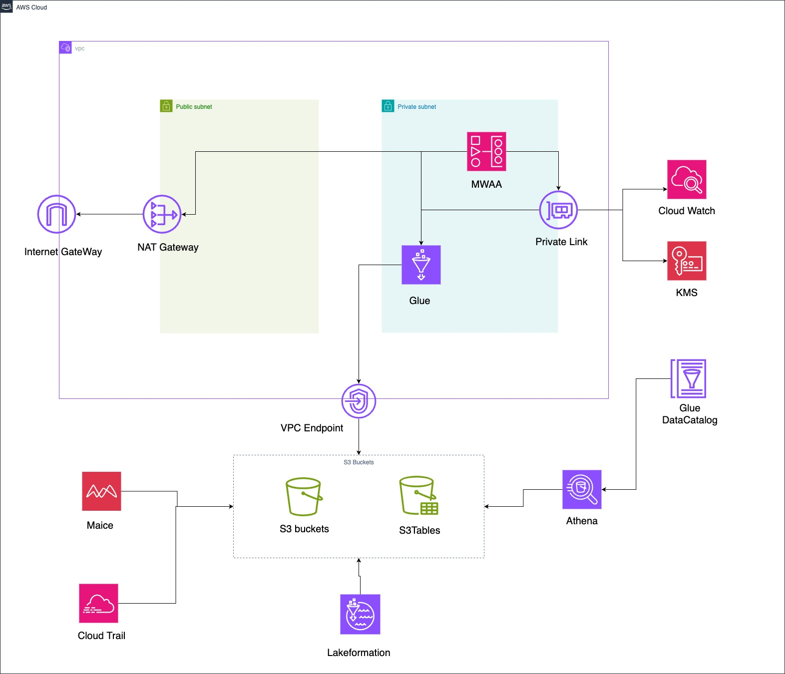
※Mwaaはコストが高い＆本書の進行に大きな影響がないため、現状コメントアウトしています。Glue画面で手動で実行することで代替可能です。

## AWS環境の初期設定

### コンソールログインの仕方

https://signin.aws.amazon.com/signin


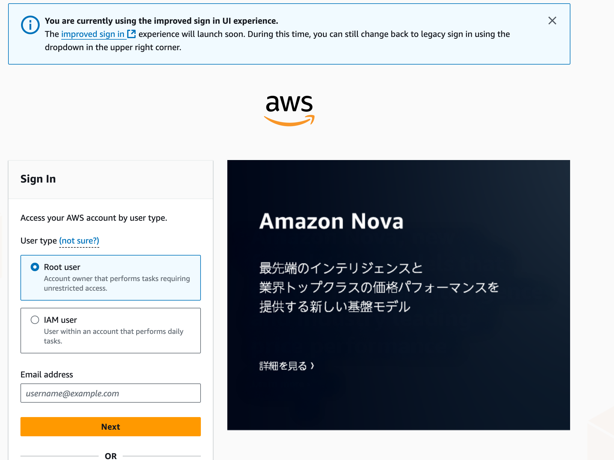

基本的な画面の構成

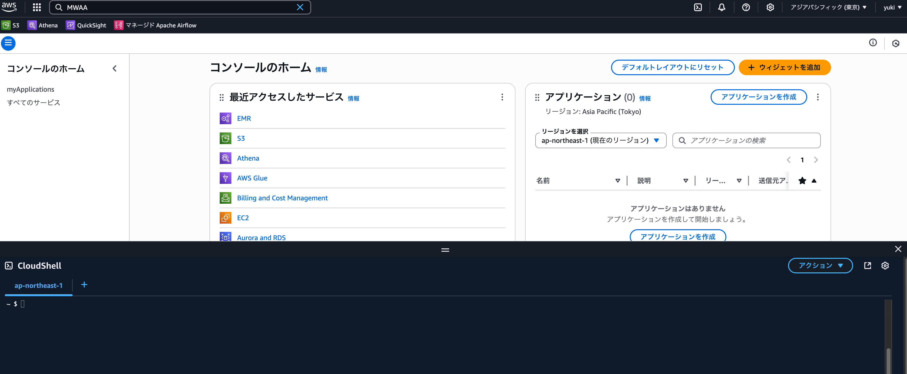

### AWSターミナル

基本的にここでコマンドを実行していきます。
利便性のため操作ユーザーはルート権限を持ちます。

### コストタグの作成


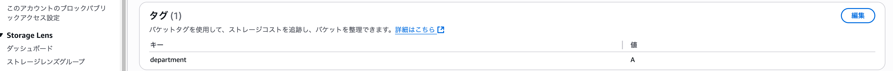

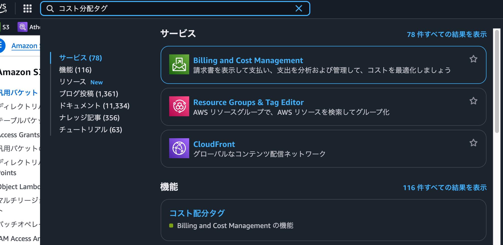


少々待ちます(1日ほど)
なくても動作可能なので放っておいても問題ありません。


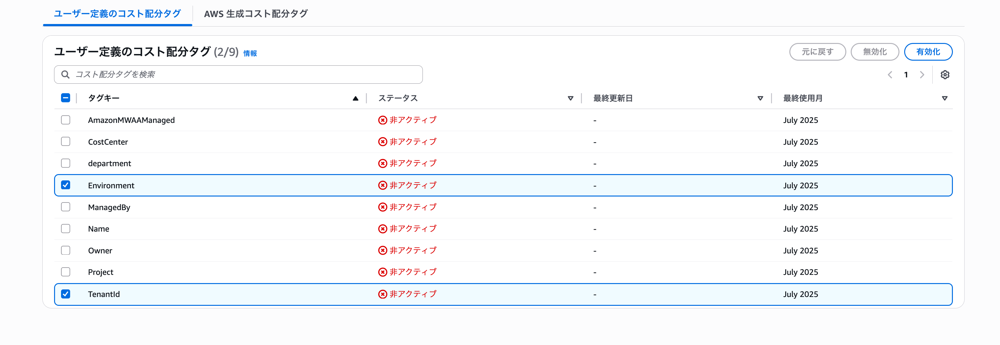

### Terrafrom用のIAM


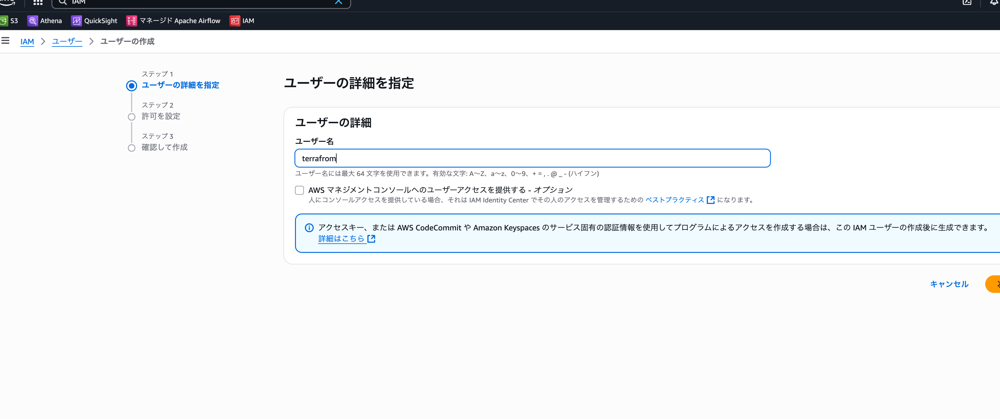

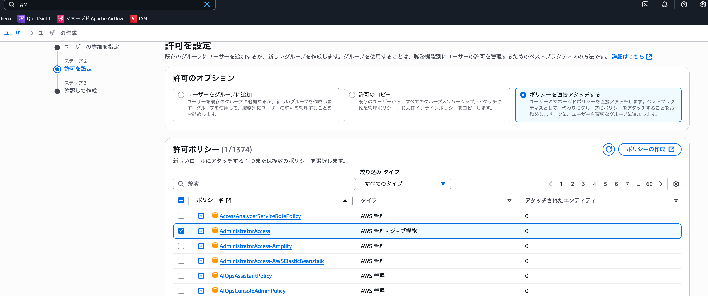

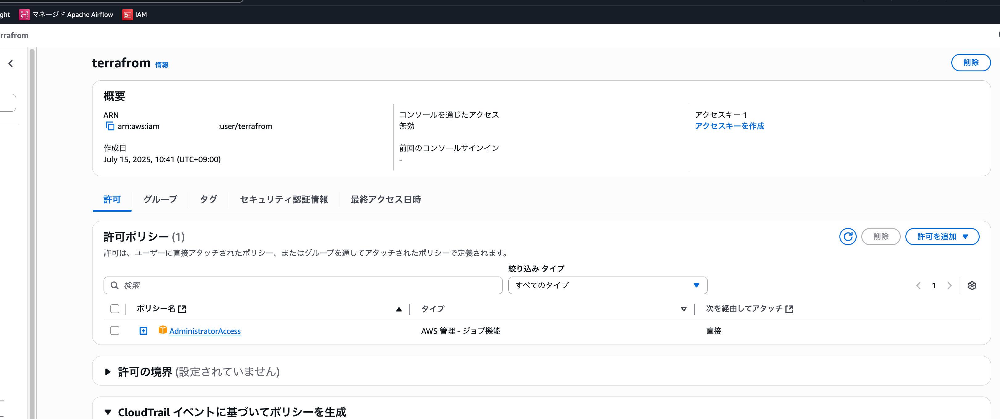

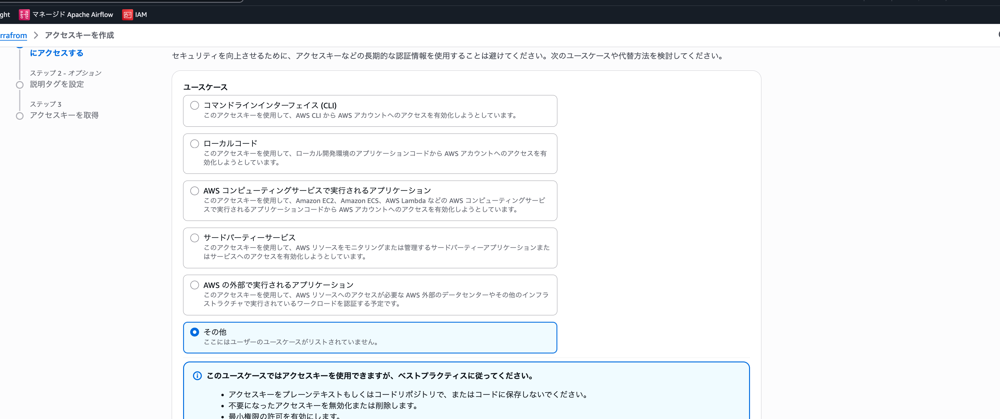

シークレットキーとアクセスキーが生成されるので大切に保管してください

### S3Tablesのインテグレーション

S3ページの、「Table buckets」から「Enable integration」を選択しS3Tablesのインテグレーションを有効化します。

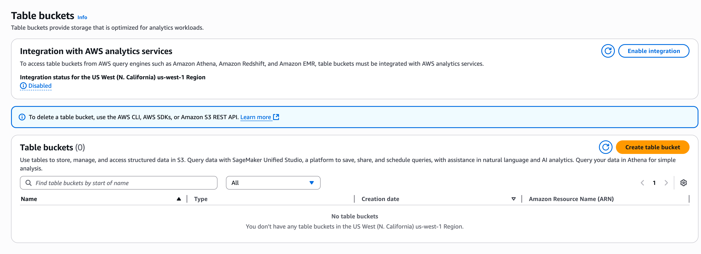
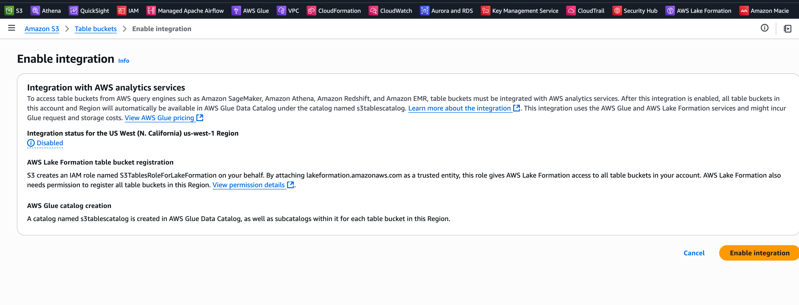

# 参考
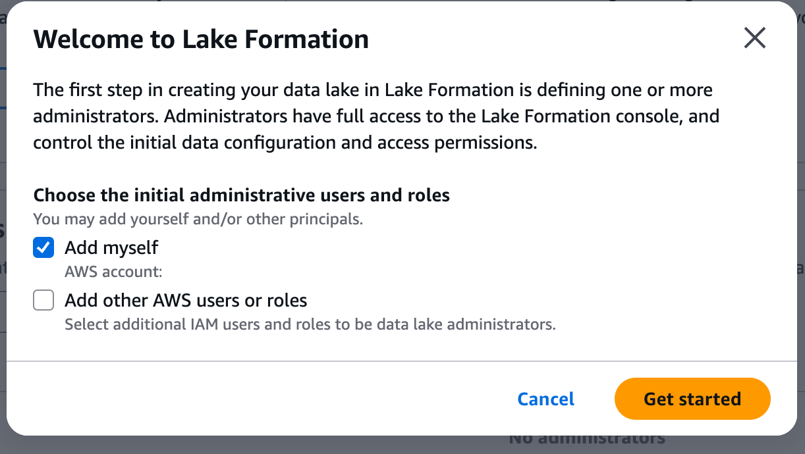

### Macie

Enable Macieを選択し、Macieを有効化します。

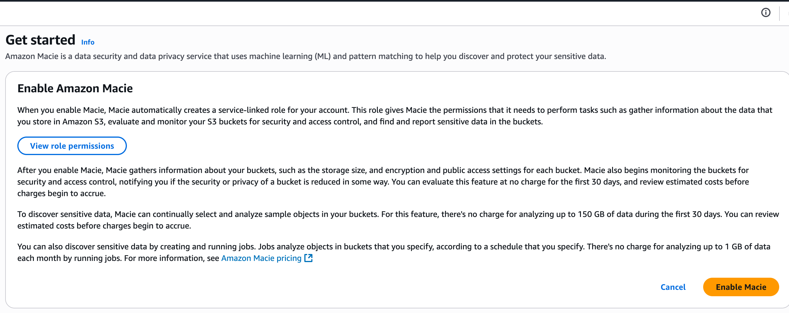


## Terraformの適用
Terraform は、クラウドやオンプレ、SaaS リソースを宣言的コードで定義し、差分適用によって環境を構築・更新する Infrastructure as Code ツールです。
HCL（HashiCorp Configuration Language）で書かれた設定ファイルにリソースや依存関係を記述し、terraform plan で人間が確認できる形の差分を生成、terraform apply でその差分だけを安全に反映します。
リソース ID や属性はステートファイルで一元管理され、S3 や Terraform Cloud に置くことでロックやバージョン管理も自動化されます。
VPC や EKS をテンプレート化したモジュールを共有すれば、チーム横断で再利用・標準化が容易になり、変数やワークスペース機能により開発環境と本番環境を同じコードベースで切り替えられます。
多数のプロバイダーが用意されているため、AWS・Azure・GCP から SaaS までを単一ワークフローで管理でき、CLI や API を通じて GitHub Actions や Jenkins と連携した継続的デリバリーにも組み込みやすいのが大きな特徴です。

https://www.terraform.io/

## 前提
Terraformユーザーのキーとシークレットを「.aws/config」へ設定してください

```.aws/config

[default]
region = ap-northeast-1
output = json
aws_access_key_id = AAAAAAAAAABBBBBBBBBB
aws_secret_access_key = CCCCC

```

terrafrom用のコンテナを用意してください
docker compose build
docker compose up -d

## 適用
suffix(e.g yuki-sample)はバケット名に利用されるため、ユニークな名前を指定してください。

docker exec -it dev_shell sh -c "cd terraform && terraform init"
docker exec -it dev_shell sh -c "cd terraform && terraform plan -var='bucket_naming_suffix=yuki-sample' -var='aws_region=ap-northeast-1'"
docker exec -it dev_shell sh -c "cd terraform && terraform apply -auto-approve -var='bucket_naming_suffix=yuki-sample' -var='aws_region=ap-northeast-1'"

※ bucket_naming_suffixとaws_regionは適宜変更してください
※ ap-northeast-1がデフォルト利用リージョンです。
　以外のリージョンの場合はVariables.tfに記載の変数を適切に変更してください。


### 適用結果の確認

適用後の結果は以下のようになります。

```
Apply complete! Resources: 1 added, 8 changed, 0 destroyed.

Outputs:

athena_workgroup_arn = "arn:aws:athena:ap-northeast-1:AAAAAAAAA:workgroup/data-platform-workgroup"
athena_workgroup_name = "data-platform-workgroup"
cloudtrail_arn = "arn:aws:cloudtrail:ap-northeast-1:AAAAAAAAA
```

### 適用後
IAMのページから「data-platform-athena-user-with-access」に対して、コンソールアクセスを有効にしてください。

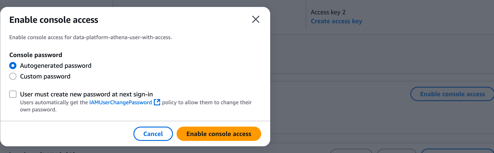

有効にするとconsole Idとパスワードが表示されるので確認し適切に管理してください。

### Athenaのロケーション設定

Athenaの設定画面から「Settings」を選択し、Query result locationを設定してください。

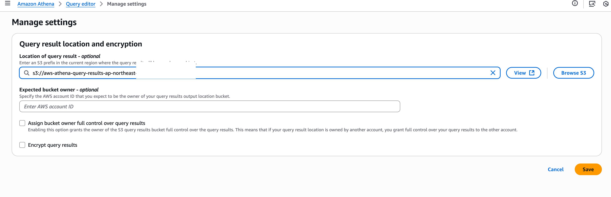

## 更新

Jobのzip化はリポジトリ内で以下のコマンドを実行してください。

```
cd mwaa/scripts && pwd && ls -la
rm -f jobs.zip && zip -r jobs.zip jobs/ && cd -
```

## 環境の削除

環境の削除時に自動で消えず手動で削除する必要があるものがあります

## バケットの削除

Cloudshellで以下のコマンドを実行し、バケットを削除してください
suffix=yuki-sample
aws s3 rb s3://data-platform-macie-results-yuki-sample        --force
aws s3 rb s3://data-platform-mwaa-management-yuki-sample      --force
aws s3 rb s3://data-platform-source-yuki-sample               --force
aws s3 rb s3://data-platform-vpc-flow-logs-yuki-sample        --force
※ bucket_naming_suffixは適宜変更してください

data-platform-cloudtrail-audit-logs-yuki-sampleはWORM設定がされており削除できないためステートから削除してください
- docker exec -it dev_shell sh -c "cd terraform && terraform state rm aws_s3_bucket.cloudtrail_audit_logs"

※ コンソール上でバケットを空にすることで削除可能です。

## ユーザーの削除

ユーザー「data-platform-athena-user-with-access」を削除してください

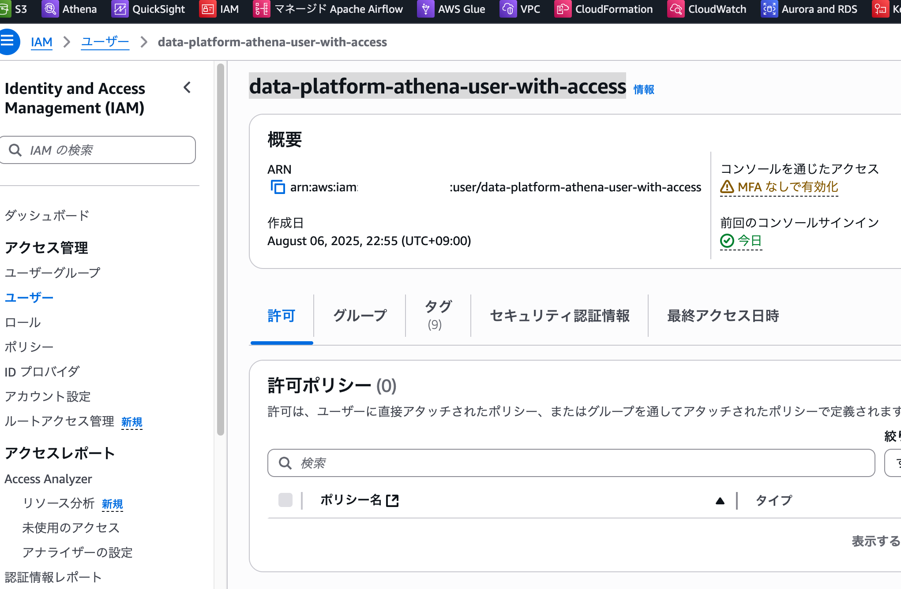

│ Error: deleting IAM User (data-platform-athena-user-with-access): operation error IAM: DeleteUser, https response error StatusCode: 409, RequestID: fdde16e7-4e0e-4ff1-844b-e315090cc8c0, DeleteConflict: Cannot delete entity, must delete login profile first.
│ 

## Athena
ワークグループ画面より「data-platform-workgroup」を削除してください
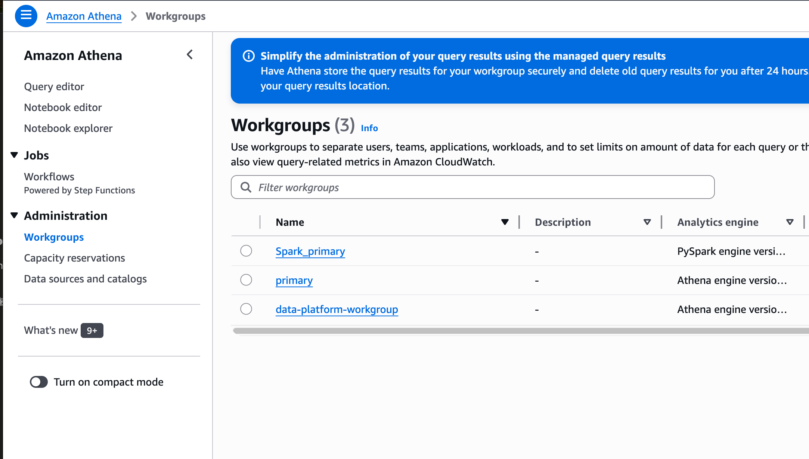

│ Error: deleting Athena WorkGroup (data-platform-workgroup): operation error Athena: DeleteWorkGroup, https response error StatusCode: 400, RequestID: 17464e11-72e6-4188-a363-badeacccf809, InvalidRequestException: WorkGroup data-platform-workgroup is not empty
│ 

## macie
Stateの管理から削除してください
- docker exec -it dev_shell sh -c "cd terraform && terraform state rm aws_macie2_classification_job.fund_master_email_detection_v5"
- docker exec -it dev_shell sh -c "cd terraform && terraform state rm aws_macie2_classification_job.legacy_fund_master_strategy_detection_v5"

### Terraformでの削除コマンド実行

docker exec -it dev_shell sh -c "cd terraform && terraform destroy -auto-approve -var='bucket_naming_suffix=yuki-sample' -var='aws_region=ap-northeast-1'"

※ bucket_naming_suffixとaws_regionは適宜変更してください

### 実行後

Emptyでバケットの中身をカラにしてください。ただし、WORMの設定が切れるまで削除することができないため現場の設定だと1日以上期間を空ける必要があります。
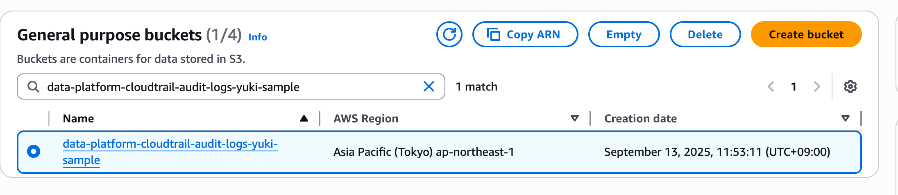

## 参考

### MCP 
Terraform MCP
https://github.com/hashicorp/terraform-mcp-server#building-the-docker-image-locally

### Agent
Copilot Agent

を利用して作成しました。
